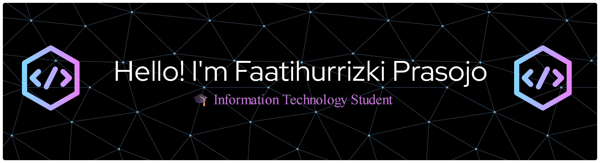

<div align="center">
  <a href="mailto:prasojofaat@gmail.com">
    
  </a>
  
  
</div>

<br/>

```js
const faat = {
  role     : "IT Student & Aspiring Web Developer",
  focus    : ["Web Development", "Software Engineering"],
  learning : "Laravel Framework — building robust & scalable apps",
  collab   : ["Open Source", "PHP/Laravel Projects", "JavaScript Apps"],
  goal     : "Turn ideas into functional, impactful applications",
  funFact  : "Won't sleep until the bug is fixed. Even if it's just a ';'",
};
```

---

### 📊 Language Usage

<!-- START:LANG_USAGE -->
```
  JavaScript     ███████████░░░░░░░░░   56.8%
  CSS            ████░░░░░░░░░░░░░░░░   20.6%
  HTML           ██░░░░░░░░░░░░░░░░░░   11.5%
  PHP            █░░░░░░░░░░░░░░░░░░░    5.0%
  Blade          █░░░░░░░░░░░░░░░░░░░    5.0%
  SCSS           ░░░░░░░░░░░░░░░░░░░░    1.0%
```
<!-- END:LANG_USAGE -->

---

### 🛠️ Tech Stack

<!-- START:TECH_STACK -->
_No topics detected. Add topics to your repos on GitHub!_

<!-- END:TECH_STACK -->
---

### 📈 GitHub Stats

<div align="center">
  
  &nbsp;
  
</div>

<div align="center">
  
</div>

---

### 🔭 Currently working on

- 🏗️ **College projects** — sharpening real-world engineering skills
- ⚡ **Laravel** — mastering MVC, Eloquent ORM, REST APIs
- 🎯 **Personal side projects** — ideas that keep me up at night

---

### 🤝 Let's collaborate

I'm actively looking to contribute to:
- Open-source PHP / Laravel repositories
- JavaScript-based web applications
- College group projects that push me outside my comfort zone

---

<div align="center">
  

  <br/><br/>

  <!-- START:LAST_UPDATED -->
_Last updated: 31 May 2026, 09:59 UTC_
<!-- END:LAST_UPDATED -->

  <br/><br/>
  <sub><code>while (!done) { code(); debug(); repeat(); }</code></sub>
  <br/><br/>
</div>